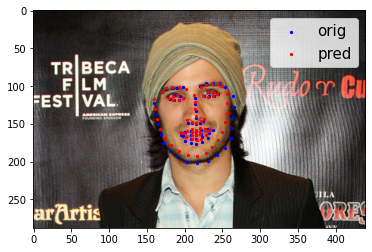

# Face Alignment 

## Описание проблемы

Необходимо реализовать алгоритм обнаружения 68 особых точек на лице человека и сравнить с результатом модели из библиотеки DLIB.

- Датасеты: 300W, Menpo (только семи-фронтальные изображения с 68 особыми точками на лице)
- Метрики: NME, CED, AUC CED
- Лосс: MSE 

Результаты модели из библиотеки DLIB:

| Датасет          | AUC 0.08 | AUC 1.0 | FR 0.08 | FR 1.0 |
| ---------------- | -------- | ------- | --------| ------ |
| Menpo Test       | 0.628    | 0.968   | 0.022   | 0.0    |
| 300W Test        | 0.761    | 0.975   | 0.008   | 0.005  |
| Menpo+300W Test  | 0.679    | 0.971   | 0.016   | 0.002  |

## Результат

<p align="center">
  
</p>
<p align="center">   
   <em> Fig.1 Сравнение результата модели и настоящих координат 68 особых точек на лице.</em>
</p>


Результат по метрике AUC 0.08  YinNet и модели из библиотеки DLIB:

| Датасет          | DLIB  | YinNet  |
| ---------------- | ----- | ------- |
| Menpo Test       | 0.628 | 0.660   |
| 300W Test        | 0.761 | 0.655   | 
| Menpo+300W Test  | 0.679 | 0.658   |

Результат по метрике AUC 1.0  YinNet и модели из библиотеки DLIB:

| Датасет          | DLIB  | YinNet | 
| ---------------- | ----- | ------ | 
| Menpo Test       | 0.968 | 0.972  |
| 300W Test        | 0.975 | 0.972  |
| Menpo+300W Test  | 0.971 | 0.972  |

## Запуск 

Чтобы запустить трейн и тест моделей, сделайте следующее:
```
git clone https://github.com/Allessyer/VisionLabs.git
cd Face-Landmarks-Detection
```
Вам необходимы скачать два файла и поместить их в ту же директорию, что и Dockerfile:
-  - датасеты
-  - веса лучшей модели

Далее небходимо запустить докер контейнер:
```
docker build . -t face_alignment:0.0
docker run -d --cpuset-cpus 100-200 --gpus '"device=0,2"' --name face_alignment face_alignment:0.0
docker exec -it face_alignment /bin/bash
```

Теперь вы находитесь в докере. 
Для запуска трейна, введите следующие команды:
```
python task_train.py
```
Для запуска теста, введите следующие команды:
```
python task_test.py
```
